# 📋 Phase 1.1 Implementation Plan: File Upload & Transcription

## 🎯 Overview
This document outlines the implementation plan for completing Phase 1 of the Repostr platform by adding file upload and transcription capabilities using Groq's free Whisper API.

**Duration:** 5-7 days  
**Priority:** Critical (Missing Phase 1 requirement)  
**Cost:** $0 (Using Groq's free API)

---

## 🚀 Goals & Objectives

### Primary Goals
1. ✅ Complete Phase 1 requirement: "File upload → transcription"
2. ✅ Implement cost-effective solution using Groq's free Whisper API
3. ✅ Create seamless user experience for project creation and file processing
4. ✅ Establish foundation for Phase 2 content generation features

### Success Criteria
- Users can upload audio/video files up to 25MB (directly) or larger (with compression)
- Transcription completes within 2 minutes for 10-minute audio
- Free tier users can create 5 projects/month
- 95%+ transcription accuracy for clear audio
- Zero transcription costs during beta phase

---

## 🏗️ Technical Architecture

### System Flow

```mermaid
graph TD
    A[User Dashboard] -->|Click New Project| B[Project Creation Modal]
    B -->|Enter Details| C[File Upload Component]
    C -->|Validate File| D{File Size Check}
    D -->|≤25MB| E[Direct Upload to Supabase]
    D -->|>25MB| F[Compress Audio]
    F -->|Still >25MB| G[Split into Chunks]
    F -->|≤25MB| E
    G --> E
    E --> H[Create Project Record]
    H --> I[Queue Transcription Job]
    I --> J[Groq Whisper API]
    J -->|Success| K[Save Transcription]
    J -->|Rate Limited| L[Queue for Retry]
    J -->|Error| M[Fallback to OpenAI]
    K --> N[Update UI]
    L --> J
    M --> K
```


### API Architecture
```yaml
New/Modified Endpoints:
  POST   /projects/{project_id}/transcribe     # Start transcription
  GET    /projects/{project_id}/transcription  # Get transcription status/result
  POST   /projects/{project_id}/files/prepare  # Pre-process large files
  GET    /usage/transcription                  # Check user's usage limits
  
Background Jobs:
  transcribe_audio_task         # Celery task for async processing
  compress_audio_task           # Compress large files
  merge_transcription_chunks    # Combine chunked transcriptions
```

---

## 📦 Component Breakdown

### Frontend Components

#### 1. **ProjectCreationModal.tsx**
```typescript
interface ProjectCreationModalProps {
  isOpen: boolean;
  onClose: () => void;
  onSuccess: (project: Project) => void;
}

// Features:
- Project name input
- Description textarea (optional)
- File upload dropzone
- File validation (format, size)
- Upload progress indicator
- Error handling
```

#### 2. **FileUploadZone.tsx**
```typescript
interface FileUploadZoneProps {
  projectId: string;
  onUploadComplete: (file: UploadedFile) => void;
  maxSizeBytes: number;
  acceptedFormats: string[];
}

// Features:
- Drag & drop support
- Click to browse
- File preview (name, size, duration)
- Compression indicator for large files
- Upload progress bar
- Cancel upload option
```

#### 3. **ProjectList.tsx**
```typescript
interface Project {
  id: string;
  title: string;
  description?: string;
  status: 'uploading' | 'processing' | 'completed' | 'failed';
  transcription?: Transcription;
  createdAt: Date;
  fileInfo: {
    name: string;
    size: number;
    duration?: number;
  };
}

// Features:
- Grid/List view toggle
- Status indicators
- Quick actions (View, Delete, Generate Content)
- Pagination
- Search/Filter
```

#### 4. **TranscriptionViewer.tsx**
```typescript
interface TranscriptionViewerProps {
  transcription: Transcription;
  isLoading: boolean;
  onEdit?: (text: string) => void;
  onGenerateContent: (type: ContentType) => void;
}

// Features:
- Display formatted transcript
- Copy to clipboard
- Edit capability (Pro/Business)
- Export options (TXT, SRT, VTT)
- Word count and duration
- Language detection display
```

### Backend Services

#### 1. **Groq Transcription Service**
```python
# services/transcription/groq_service.py
import os
from groq import Groq
from typing import Optional, Dict, Any
import aiofiles
from app.core.config import settings

class GroqTranscriptionService:
    def __init__(self):
        self.client = Groq(api_key=settings.GROQ_API_KEY)
        self.max_file_size = 25 * 1024 * 1024  # 25MB
        
    async def transcribe(
        self,
        file_path: str,
        language: Optional[str] = None,
        response_format: str = "verbose_json"
    ) -> Dict[str, Any]:
        """
        Transcribe audio using Groq's Whisper API
        
        Args:
            file_path: Path to audio file
            language: Optional language code (e.g., 'en')
            response_format: json, text, srt, verbose_json, vtt
            
        Returns:
            Transcription result with text and metadata
        """
        try:
            # Check file size
            file_size = os.path.getsize(file_path)
            if file_size > self.max_file_size:
                return await self._handle_large_file(file_path)
            
            # Direct transcription for small files
            async with aiofiles.open(file_path, 'rb') as audio_file:
                transcription = await self.client.audio.transcriptions.create(
                    file=audio_file,
                    model="whisper-large-v3",
                    response_format=response_format,
                    language=language,
                    temperature=0.0  # For consistency
                )
            
            return {
                "text": transcription.text,
                "language": transcription.language,
                "duration": transcription.duration,
                "segments": transcription.segments if response_format == "verbose_json" else None,
                "provider": "groq"
            }
            
        except RateLimitError as e:
            # Queue for retry
            return await self._queue_for_retry(file_path, e)
        except Exception as e:
            # Fallback to OpenAI or local
            return await self._fallback_transcription(file_path, e)
```

#### 2. **Audio Processing Service**
```python
# services/audio/processing_service.py
import subprocess
from pydub import AudioSegment
import tempfile
from typing import List, Tuple

class AudioProcessingService:
    @staticmethod
    async def compress_audio(
        input_path: str,
        target_bitrate: str = "64k"
    ) -> str:
        """
        Compress audio file to reduce size
        Uses FFmpeg for compression
        """
        output_path = tempfile.mktemp(suffix=".mp3")
        
        cmd = [
            "ffmpeg",
            "-i", input_path,
            "-b:a", target_bitrate,
            "-ar", "16000",  # Lower sample rate for speech
            "-ac", "1",      # Mono audio
            output_path
        ]
        
        subprocess.run(cmd, check=True)
        return output_path
    
    @staticmethod
    async def split_audio(
        input_path: str,
        chunk_duration_seconds: int = 600  # 10 minutes
    ) -> List[Tuple[str, float, float]]:
        """
        Split audio into chunks for processing
        Returns list of (chunk_path, start_time, end_time)
        """
        audio = AudioSegment.from_file(input_path)
        chunks = []
        
        for i in range(0, len(audio), chunk_duration_seconds * 1000):
            chunk = audio[i:i + chunk_duration_seconds * 1000]
            chunk_path = tempfile.mktemp(suffix=".mp3")
            chunk.export(chunk_path, format="mp3")
            
            start_time = i / 1000
            end_time = min((i + chunk_duration_seconds * 1000) / 1000, len(audio) / 1000)
            chunks.append((chunk_path, start_time, end_time))
        
        return chunks
```

#### 3. **Usage Tracking Service**
```python
# services/usage/tracking_service.py
from datetime import datetime, timedelta
from typing import Dict, Any
from app.db.supabase import get_supabase_client

class UsageTrackingService:
    def __init__(self):
        self.supabase = get_supabase_client()
    
    async def check_transcription_quota(
        self,
        user_id: str,
        user_plan: str = "free"
    ) -> Dict[str, Any]:
        """
        Check if user has remaining transcription quota
        """
        # Get plan limits
        limits = {
            "free": {"projects_per_month": 5, "max_duration_minutes": 20},
            "pro": {"projects_per_month": -1, "max_duration_minutes": 60},
            "business": {"projects_per_month": -1, "max_duration_minutes": 180}
        }
        
        plan_limits = limits.get(user_plan, limits["free"])
        
        # Count projects this month
        start_of_month = datetime.now().replace(day=1, hour=0, minute=0, second=0)
        
        result = self.supabase.table("projects") \
            .select("count") \
            .eq("user_id", user_id) \
            .gte("created_at", start_of_month.isoformat()) \
            .execute()
        
        projects_count = result.data[0]["count"] if result.data else 0
        
        # Check if within limits
        if plan_limits["projects_per_month"] != -1:
            remaining = plan_limits["projects_per_month"] - projects_count
            can_upload = remaining > 0
        else:
            remaining = -1  # Unlimited
            can_upload = True
        
        return {
            "can_upload": can_upload,
            "projects_used": projects_count,
            "projects_limit": plan_limits["projects_per_month"],
            "projects_remaining": remaining,
            "max_duration_minutes": plan_limits["max_duration_minutes"]
        }
```

---

## 🗄️ Database Schema Updates

```sql
-- Add to existing schema

-- Transcriptions table (if not exists)
CREATE TABLE IF NOT EXISTS transcriptions (
    id UUID PRIMARY KEY DEFAULT gen_random_uuid(),
    file_id UUID REFERENCES files(id) ON DELETE CASCADE,
    user_id TEXT NOT NULL,
    content TEXT NOT NULL,
    language TEXT DEFAULT 'en',
    duration_seconds FLOAT,
    word_count INTEGER,
    confidence FLOAT,
    segments JSONB,  -- Detailed segments with timestamps
    provider TEXT DEFAULT 'groq',  -- groq, openai, local
    processing_time_ms INTEGER,
    created_at TIMESTAMPTZ DEFAULT NOW()
);

-- Usage tracking table
CREATE TABLE IF NOT EXISTS usage_tracking (
    id UUID PRIMARY KEY DEFAULT gen_random_uuid(),
    user_id TEXT NOT NULL,
    resource_type TEXT NOT NULL,  -- 'transcription', 'generation', etc.
    resource_id UUID,
    credits_used INTEGER DEFAULT 1,
    metadata JSONB,
    created_at TIMESTAMPTZ DEFAULT NOW(),
    
    -- Index for quick monthly queries
    INDEX idx_usage_user_date (user_id, created_at DESC)
);

-- Add status fields to projects table
ALTER TABLE projects 
ADD COLUMN IF NOT EXISTS status TEXT DEFAULT 'created',
ADD COLUMN IF NOT EXISTS processing_started_at TIMESTAMPTZ,
ADD COLUMN IF NOT EXISTS processing_completed_at TIMESTAMPTZ,
ADD COLUMN IF NOT EXISTS error_message TEXT;

-- Add metadata to files table
ALTER TABLE files
ADD COLUMN IF NOT EXISTS duration_seconds FLOAT,
ADD COLUMN IF NOT EXISTS audio_codec TEXT,
ADD COLUMN IF NOT EXISTS is_compressed BOOLEAN DEFAULT FALSE;
```

---

## 🔧 Configuration & Environment

### Environment Variables
```env
# Add to backend/.env
GROQ_API_KEY=gsk_your_groq_api_key_here
GROQ_API_ENDPOINT=https://api.groq.com/openai/v1
GROQ_MODEL=whisper-large-v3
GROQ_RATE_LIMIT_RPM=30
GROQ_RATE_LIMIT_AUDIO_SECONDS_PER_HOUR=7200

# Optional fallback
OPENAI_API_KEY=sk_your_openai_key_here  # Optional
USE_FALLBACK_TRANSCRIPTION=true

# Audio processing
FFMPEG_PATH=/usr/bin/ffmpeg
MAX_AUDIO_FILE_SIZE_MB=25
COMPRESS_LARGE_FILES=true
AUDIO_CHUNK_DURATION_SECONDS=600

# Usage limits
FREE_TIER_PROJECTS_PER_MONTH=5
FREE_TIER_MAX_DURATION_MINUTES=20
```

### Dependencies to Add

#### Frontend (package.json)
```json
{
  "dependencies": {
    "react-dropzone": "^14.2.3",
    "axios": "^1.6.0",
    "react-hot-toast": "^2.4.1",
    "@tanstack/react-query": "^5.0.0",
    "date-fns": "^3.0.0"
  }
}
```

#### Backend (requirements.txt)
```txt
groq==0.4.1
pydub==0.25.1
ffmpeg-python==0.2.0
redis==5.0.1
celery==5.3.4
python-multipart==0.0.6
aiofiles==23.2.1
```

---

## 📊 User Interface Flows

### Flow 1: Creating a New Project
```
1. User clicks "New Project" button on dashboard
2. Modal opens with form:
   - Project Title (required)
   - Description (optional)
   - File Upload Zone
3. User drags/selects file
4. System validates:
   - File format (mp3, wav, m4a, mp4, etc.)
   - File size (warn if >25MB)
   - User quota (free tier limits)
5. If valid:
   - Upload to Supabase Storage
   - Create project record
   - Start transcription job
   - Show progress indicator
6. If invalid:
   - Show specific error message
   - Offer solutions (compress, upgrade plan)
```

### Flow 2: Viewing Transcription
```
1. User clicks on project from dashboard
2. Project detail page/modal shows:
   - File info (name, size, duration)
   - Processing status
   - Transcription (when ready)
   - Action buttons (Generate Content, Export, Edit)
3. If still processing:
   - Show progress bar
   - Estimated time remaining
   - Cancel option
4. If completed:
   - Display formatted transcript
   - Show metadata (language, duration, word count)
   - Enable content generation buttons
```

---

## 🧪 Testing Strategy

### Unit Tests
```python
# tests/test_groq_service.py
def test_groq_transcription():
    """Test Groq API transcription"""
    pass

def test_file_compression():
    """Test audio compression for large files"""
    pass

def test_audio_chunking():
    """Test splitting audio into chunks"""
    pass

def test_usage_tracking():
    """Test quota enforcement"""
    pass
```

### Integration Tests
```python
# tests/integration/test_upload_flow.py
def test_complete_upload_flow():
    """
    Test complete flow:
    1. Create project
    2. Upload file
    3. Process transcription
    4. Retrieve result
    """
    pass

def test_rate_limit_handling():
    """Test Groq rate limit handling and queuing"""
    pass

def test_large_file_handling():
    """Test compression and chunking for large files"""
    pass
```

### Frontend Tests
```typescript
// __tests__/ProjectCreation.test.tsx
describe('Project Creation', () => {
  it('should validate file formats', () => {});
  it('should show quota warnings', () => {});
  it('should handle upload errors', () => {});
});

// __tests__/TranscriptionViewer.test.tsx
describe('Transcription Viewer', () => {
  it('should display transcription text', () => {});
  it('should enable content generation when ready', () => {});
  it('should handle export actions', () => {});
});
```

---

## 🚀 Implementation Steps

### Day 1-2: Backend Foundation
- [ ] Set up Groq API client and service
- [ ] Implement audio compression/chunking utilities
- [ ] Create transcription endpoints
- [ ] Add Celery tasks for async processing
- [ ] Update database schema

### Day 3-4: Frontend UI
- [ ] Create ProjectCreationModal component
- [ ] Build FileUploadZone with drag-and-drop
- [ ] Update dashboard with project list
- [ ] Add TranscriptionViewer component
- [ ] Implement progress indicators

### Day 5: Integration & Testing
- [ ] Connect frontend to backend APIs
- [ ] Test file upload flow end-to-end
- [ ] Handle error cases and edge conditions
- [ ] Test with various file formats and sizes

### Day 6: Usage Tracking & Limits
- [ ] Implement usage tracking service
- [ ] Add quota checks to upload flow
- [ ] Display usage in user dashboard
- [ ] Test free tier limitations

### Day 7: Polish & Documentation
- [ ] Add loading states and animations
- [ ] Improve error messages
- [ ] Write user documentation
- [ ] Performance optimization
- [ ] Final testing and bug fixes

---

## 📈 Success Metrics

### Technical Metrics
- Transcription accuracy > 95% for clear audio
- Processing time < 20% of audio duration
- File upload success rate > 99%
- API error rate < 1%

### User Metrics
- Time to first transcription < 3 minutes
- User satisfaction with transcription quality > 4.5/5
- Free tier conversion rate > 10%
- Project completion rate > 80%

### Business Metrics
- Zero transcription costs (using Groq free tier)
- Server costs < $50/month for MVP
- Support tickets < 5% of active users

---

## 🎯 Definition of Done

### Checklist
- [ ] Users can create projects and upload files
- [ ] Files are transcribed automatically using Groq API
- [ ] Transcriptions are displayed in the UI
- [ ] Free tier limits are enforced
- [ ] Large files are handled gracefully
- [ ] Error handling covers all edge cases
- [ ] Tests achieve 80% coverage
- [ ] Documentation is complete
- [ ] Performance meets targets
- [ ] Security review passed

---

## 🔒 Security Considerations

1. **File Validation**
   - Validate MIME types server-side
   - Scan for malicious content
   - Enforce file size limits

2. **API Security**
   - Never expose Groq API key to frontend
   - Rate limit user requests
   - Validate JWT tokens on all endpoints

3. **Data Privacy**
   - Encrypt files at rest in Supabase
   - Clear temporary files after processing
   - Allow users to delete their data

---

## 📚 Documentation Requirements

1. **User Documentation**
   - How to upload files
   - Supported formats and limits
   - Understanding transcription quality
   - Troubleshooting guide

2. **API Documentation**
   - Update API reference with new endpoints
   - Document request/response formats
   - Include example code

3. **Developer Documentation**
   - Groq API integration guide
   - Audio processing pipeline
   - Error handling patterns

---

## 🚨 Risk Mitigation

### Identified Risks

1. **Groq API becomes paid**
   - Mitigation: Implement OpenAI fallback
   - Have local Whisper ready as backup

2. **Rate limits hit during peak usage**
   - Mitigation: Queue system with fair scheduling
   - Show estimated wait times to users

3. **Large files cause timeouts**
   - Mitigation: Async processing with Celery
   - Progress indicators for user feedback

4. **Poor audio quality affects accuracy**
   - Mitigation: Audio enhancement preprocessing
   - Allow manual corrections (Pro feature)

---

## 📞 Support & Resources

### External Documentation
- [Groq API Documentation](https://console.groq.com/docs)
- [Whisper Model Information](https://github.com/openai/whisper)
- [FFmpeg Audio Processing](https://ffmpeg.org/documentation.html)
- [Pydub Documentation](https://github.com/jiaaro/pydub)

### Internal Resources
- [API Reference](./API_REFERENCE.md)
- [Database Schema](./DATABASE_SCHEMA.md)
- [Phase 2-3 Plan](./PHASE_2_3_IMPLEMENTATION_PLAN.md)

---

*Last Updated: 2024-01-31*  
*Version: 1.0*
